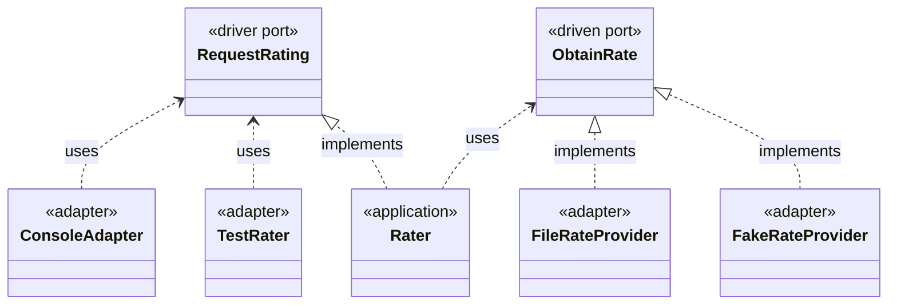

# About Py-Hexagon

Like the original by Alistair, this is an example of a simple rate calculation application 
with one driver (left) port and one driven (right) port.

- **Application** ( *rater.py* ) 
  - simply calculates the formula: `result = input * rate`.
    - The `input` is provided by an adapter connected to the driver port.
    - The `rate` is retrieved from an adapter connected to the driven port.
- **Driver port** ( *request_rating.py* )
  - This port is connected to one of the following:
    - An **adapter** that provides input from the user through a console ( *console_adapter.py* )
    - A test (acting as **adapter**) that provides fake input ( *test_rater.py* )
- **Driven port** ( *obtain_rates.py* )
  - This port is connected to one of the following:
    - An **adapter** getting rates from a file ( *file_rate_provider.py* )
    - A fake **adapter** with hardcoded rates ( *test_rater.py* )
- **Connecting** adapters to the ports happens when:
  - The program is run ( *\__main\__.py* )
  - The tests are run ( *test_rater.py* )

*To keep the example short, input sanitization and error handling have been left out.*
*This is not production ready code,*
*it merely serves to convey the concept of hexagonal architecture.*

## UML class diagram

