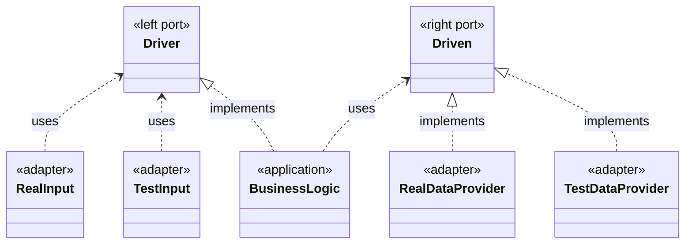

# Hexagonal Architecture

## Intent

The primary characteristic of hexagonal architecture (also called Ports and Adapters) 
is: *"Configurable Dependency"*.
In particular IO dependencies are kept separate from the application 
(containing the business logic), 
meaning they can be easily substituted.
This keeps the business logic free from any technology concerns, 
and allows it to be tested in isolation.

## Overview 
Below, the UML class diagram gives an overview of 
how the application, ports and adapters relate to each other.

### Ports

The application only communicates with the outside world through (any number of) ports.
A port is just an interface, 
which serves as a contract for how interaction with the outside occurs.
Ports are often named after the interaction they allow, 
for example `SelectDrink`, `ObtainPrice`, `RequestMedicine`.

It's important to know that there are 2 types of ports. 
The left and right side of the hexagon are asymmetrical.

| Driver (left-side) ports                                                                                                                                                                            | Driven (right-side) ports                                                                                                                                                                                |
|-----------------------------------------------------------------------------------------------------------------------------------------------------------------------------------------------------|:---------------------------------------------------------------------------------------------------------------------------------------------------------------------------------------------------------|
| Starts the interaction with the application.                                                                                                                                                        | Is caused to act as a result of the interaction.                                                                                                                                                         |
| Example users of this port are: humans, remote applications, etc.                                                                                                                                   | Example users of this port are either:  - **Repositories**, e.g: A database to obtain information from.  - **Recipients**, e.g: An SMTP server for sending emails.                               |
| An adapter connected to this port will request actions from the application.                                                                                                                        | An adapter connected to this port will be requested, by the application, to perform actions.                                                                                                             |
| This port interface is implemented by the application. And the left adapter will use it.                                                                                                            | This port interface is implemented by the right side adapter. And it's used by the application.                                                                                                          |
| Driver ports offer the application functionality to the outside world. Thus, driver ports are said to be the use case boundary of the application. They are the API of the application.             | A driven port is an interface for a functionality, needed by the application, for implementing the business logic. So driven ports are the SPI (Service Provider Interface) required by the application. |

### Adapters
Adapters implement a specific technology to communicate to the application
through its ports.
Given a port, there may be an adapter for each technology that is desired. 

- There should always be at least 2 adapters for each port:
  - a real driver that will run the application,
  - and one for testing the behaviour of the port.

### Configuration
Which adapter to use for each port needs to be configured. 
This usually happens in the main file, or in the setup of tests.

- Configuration is a 3-step process:
  - (1) Each driven adapter is instantiated. 
  - (2) The driven adapters are passed to the application. 
  - (3) The application is passed to each driving adapter.

## Further Information

### Articles
- Original article by Alistair Cockburn: [Hexagonal-Architecture](https://alistair.cockburn.us/hexagonal-architecture/)
- Endorsed by Alistair Cockburn: [Hexagonal Architecture Articles by Juan Manuel Garrido de Paz’](https://jmgarridopaz.github.io/content/articles.html)
- [A color coded guide to ports and adapters by Damon Kelley](https://8thlight.com/insights/a-color-coded-guide-to-ports-and-adapters)

### Talks
- Alistair in the Hexagone: [Part-1](https://youtu.be/th4AgBcrEHA), [Part-2](https://youtu.be/iALcE8BPs94) and [Part-3](https://youtu.be/DAe0Bmcyt-4).
- Rodrigo Branas’ interview: [Hexagonal Architecture (Ports and Adapters) with Alistair Cockburn // Live #98](https://youtu.be/AOIWUPjal60)
- [The clean architecture by Ian Cooper](https://youtu.be/SxJPQ5qXisw)